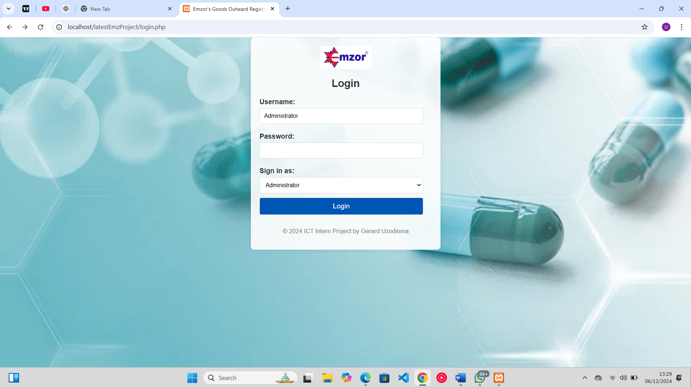
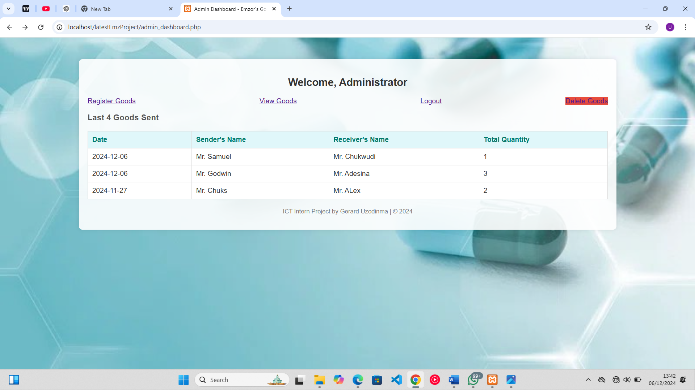
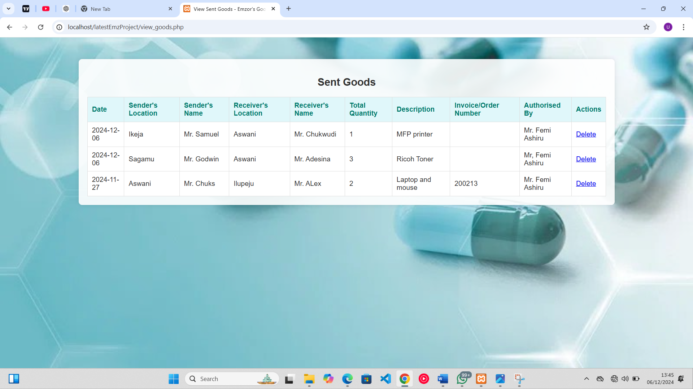
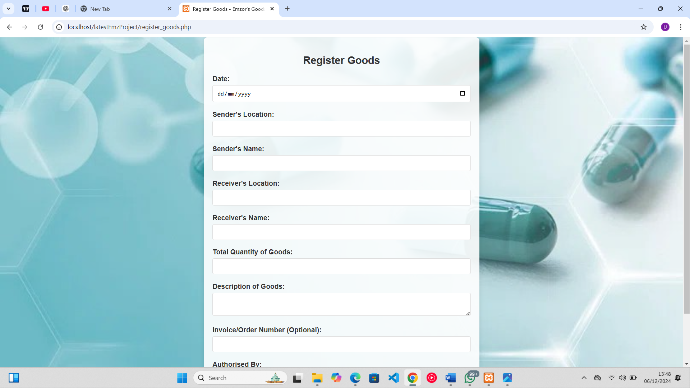
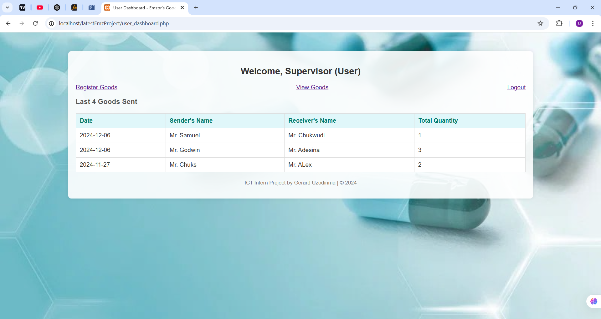
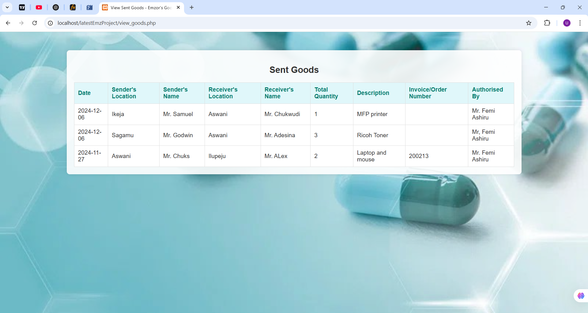

# Emzor Goods Outward Register

A web-based application for managing and tracking outgoing goods at Emzor Pharmaceutical Industries. This system allows users to register, track, and manage goods being sent out from different locations.

## Features

- **User Authentication System**
  - Secure login for both administrators and regular users
  - Role-based access control
  - Password hashing for security

- **Goods Management**
  - Register new outgoing goods
  - Track goods with detailed information
  - View comprehensive list of sent goods
  - Delete records (admin only)

- **Dashboard Interface**
  - Admin dashboard with full control
  - User dashboard with limited privileges
  - Quick overview of recent transactions
  - Real-time updates

## Screenshots

### Login Page

*Secure login interface for both administrators and users*

### User Dashboard

*User interface showing recent goods transactions*

### Admin Dashboard

*Administrative dashboard with additional controls*

### Register Goods

*Form for registering new outgoing goods*

### View Goods

*Comprehensive list of all registered goods*

### Delete Goods

*Admin interface for managing goods records*

## Technology Stack

- **Backend:** PHP
- **Database:** MySQL
- **Frontend:** HTML, CSS
- **Security:** Password hashing using PHP's built-in functions

## Project Structure

```
├── admin_dashboard.php    # Administrator dashboard interface
├── config.php            # Database configuration and connection
├── delete_goods.php      # Handles deletion of goods records
├── login.php            # User authentication
├── logout.php           # Session termination
├── register_goods.php   # Form for registering new goods
├── setup_database.sql   # Database structure and initial setup
├── styles.css          # CSS styling
├── user_dashboard.php  # Regular user dashboard
└── view_goods.php     # Display goods records
```

## Installation

1. Clone the repository to your web server directory
2. Create a MySQL database
3. Import the database structure using `setup_database.sql`
4. Configure your database credentials in `.env` file:
   ```
   DB_HOST=localhost
   DB_USERNAME=your_username
   DB_PASSWORD=your_password
   DB_NAME=your_database_name
   ```
5. Ensure your web server has PHP installed (version 7.0 or higher recommended)
6. Access the application through your web browser

## Security Features

- Password hashing using PHP's password_hash()
- Prepared SQL statements to prevent SQL injection
- Session-based authentication
- Role-based access control
- Environment variables for sensitive data

## Usage

### As Administrator
1. Login with admin credentials
2. Access full system functionality
3. Register new goods
4. View all transactions
5. Delete records as needed
6. Manage user access

### As Regular User
1. Login with user credentials
2. View dashboard with recent transactions
3. Register new goods
4. View transaction history

## Environment Variables

Create a `.env` file in the root directory with the following variables:
```
DB_HOST=localhost
DB_USERNAME=your_username
DB_PASSWORD=your_password
DB_NAME=your_database_name
ADMIN_USERNAME=admin_username
ADMIN_PASSWORD_HASH=hashed_password
USER_USERNAME=user_username
USER_PASSWORD_HASH=hashed_password
```

## Development

Project developed by Gerard Uzodinma as part of ICT Internship at Emzor Pharmaceutical Industries.

## License

© 2024 ICT Intern Project by Gerard Uzodinma. All Rights Reserved.

## Security Note

Remember to:
- Keep your .env file secure and never commit it to version control
- Regularly update passwords
- Maintain proper backup of the database
- Monitor system access logs
- Keep PHP and MySQL updated to latest stable versions